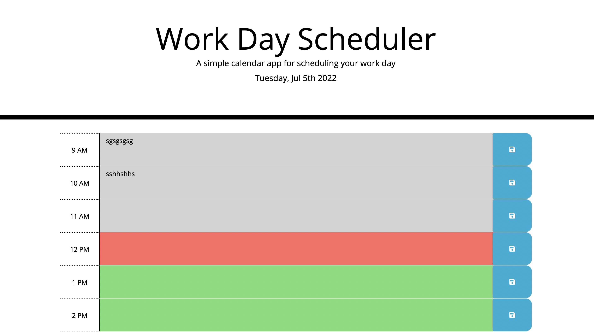

# Work Day Scheduler

## Description
I created a simple calendar application that allows a user to save events for each hour of the day by modifying starter code. This app will run in the browser and feature dynamically updated HTML and CSS powered by jQuery.

- Why did you build this project? 
I built this project to give the user and easy and sufficient way to be able to schedule all important events happening whithin the 9-5 work schedule in this daily planner, it gives easy access, smooth scrolling, when the page is refreshed the saved events persistit and the user could view the timeblocks for that day and each timeblock is color coded to indicate whether it is in the past, present, or future. 

## Usage

## License

License

---
